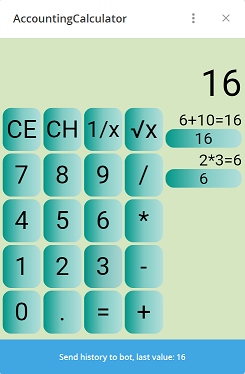

# accounting-calculator-bot

AccountingCalculatorBot demonstrates how telegram can be enriched with external web app.

User can launch Web App with Keyboard Button, make some calculations and receive history back in bots chat.
There exists 4 different ways user can launch Web App but only Keyboard Button supports receiving data back.

Working bot: https://t.me/AccountingCalculatorBot

Web app: https://accountingcalculator-37edb.web.app

Flutter Web app sources: https://github.com/ade1963/flutter-accounting-calculator.git

  

